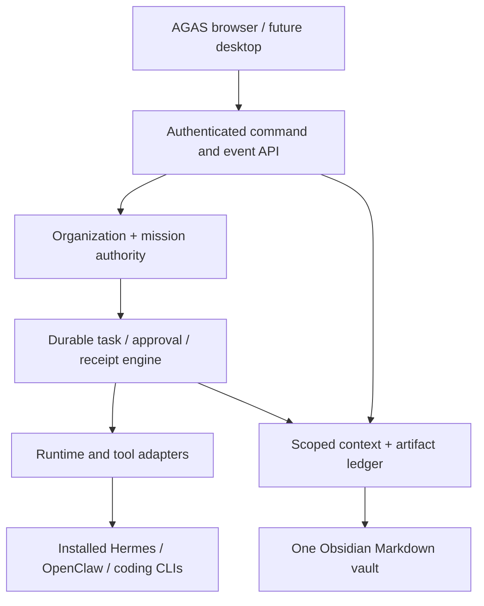

# AGAS — native product contract

Status: 26 September 2026. This document supersedes the AionUI/Paperclip foundation and the preliminary native v3 blueprint. It is a specification and delivery plan; a proposed capability is not a shipped capability.

## Decision record and evidence

The owner's latest instruction controls when historical proposals disagree. AGAS means **Accessible General AI System**. Build AGAS's own interface, organization, mission authority, context fabric and workflows. Use the [Agency Agents](https://github.com/msitarzewski/agency-agents) repository solely as a pinned source of specialist role definitions. Connect capable, installed runtimes such as Hermes, OpenClaw, Codex, Claude Code and OpenCode through explicit adapters. A role definition is not an executable agent; a detected CLI is not an authenticated or running agent. AionUI and Paperclip are product references for usability and organization, not the shell, database or boot dependencies. MBAs remains an independent product: do not copy its code, data, branding, bookings or deployment into AGAS.

The recovered attachments `01-AGAS_Master_Architecture_and_Implementation_Plan.md`, `03-AGAS_JARVIS_UI_Reference_Brief.md`, `06-AGAS_Six_Repository_Review.md`, `08-AGAS_Full_Project_Comparison.md`, `11-DETAILED_RECOVERY_REPORT.md`, `12-AGAS_Project_Recovery.zip`, and the conversation exports in `project_sources/13–25` informed this contract. `upload/Pasted markdown.md:141–159` records the owner's explicit MBAs separation; that correction supersedes the older master plan's Business/MBAs coupling. Historical MANI/ADAMS/KEVIN/ARCHON/creAGI/AGICode/FinOS texts are research and domain intent, not proof that software was deployed. Missing older PDFs are marked missing in the recovery report; do not imply their bytes were read. The 26 September conversation further specifies one Obsidian vault, a permanent executive and hub CEOs, direct CEO communication, cross-platform delivery, a spatial Dev experience, and the new supplied dragon-eye logo.

| Owner requirement | Product interpretation | First verifiable gate |
|---|---|---|
| One coherent AGAS, seven hubs and media/software companies | One persistent organization, executive, permanent CEOs, project-scoped teams | Restored identities, seven hub workspaces, durable mission ownership |
| Any installed capable agent works together | Capability/readiness detection, adapters, typed handoffs, receipts | Two real runtime adapters complete a cross-hub task after restart |
| Prebuilt Agency agents with distinct icons | Pin upstream catalog; import actual role prompts; configure assistant separately | Source SHA, imported body, icon, bindings and license visible |
| One Obsidian vault for everything meaningful | Scoped records project readable Markdown into one vault; selected user edits import with revision checks | Authorized notes project/import; private data stays out of other scopes |
| AionUI/Paperclip-like product feel and coverage | Original polished assistant cards, chat, organization, work boards, inbox, evidence inspector | Browser flows work without another app or fake responses |
| Dev Hub and media empire | Persistent CEOs, delivery pipelines, agents and bounded parallel work | Real Dev repository task, then sourced content campaign with review |
| Cross-platform and later JARVIS experience | Web core on Windows/macOS/Linux; optional desktop/voice/spatial/OS layers | Clean-machine install on all three; specialized UI staged |
| Performance, accuracy, productivity | Measure against same-task baseline; budget and routing enforce bounded work | Published fixtures and p50/p95 latency, accepted outcomes, cost |

## Product and trust topology

AGAS owns canonical IDs, access decisions, runs, missions, side effects, approvals, provenance and revisions. Agents can propose work; they cannot silently grant themselves tool access or declare external work complete. Use a local transactional database for authoritative state and append events/outbox entries in the same transaction. Project approved, human-readable knowledge to **one** vault. Vault edits import through validation; `.md` files are not a transactional queue, identity system, credential store or source of secret material. Search and embeddings are rebuildable indexes. A future remote worker connects through authenticated scoped contracts; it does not directly write the central vault or database.

## Organization and identity

The user talks to **AGAS Executive** (one stable persona backed by a configurable planning runtime) or directly to a hub CEO. A direct CEO request becomes a mission/event visible in the executive's organization feed, with privacy summaries where needed. Executive coordinates goals, dependencies and budgets; hub CEOs own their queues, assign bounded tasks and report accepted outcomes. CEOs are persistent *records*, not permanently running inference loops. Workers wake for a task, return evidence, and release resources. Humans may reassign or stop work at each boundary.

| Hub | CEO mandate | Example activated Agency specialists | Domain boundary |
|---|---|---|---|
| Dev / Software | Design, build, test and deliver software | Frontend Developer, Backend Architect, DevOps Automator, Reality Checker | Isolated worktrees, reviews, deployments by approval |
| Content / Media Empire | Operate brands, niches, campaigns and accounts | Content Creator, Social Media Strategist, Research Analyst, Editor | Brand/account scopes; drafts before permitted publishing |
| Finance | Research, budgets and financial monitoring | CFO, data/research roles | Paper/research first; independent deterministic risk and ledgers |
| Business | General business strategy and operations | Business Strategist, support/product roles | AGAS native business objects; **no MBAs migration** |
| Family Health | Consented family records and routines | Healthcare/coordination roles | Per-person privacy, provenance, no unreviewed clinical acts |
| Authorized Security | Scope-bound assessment and remediation | Security specialists, reviewers | Owned targets, explicit assessment scope and evidence |
| Management / Maintenance | Fleet health, costs, incidents, improvements | Chief of Staff, operations roles | Cannot self-expand production authority |

Each hub exposes Overview, CEO conversation, Missions, Team, Knowledge, Artifacts and Settings. Media supports many brands, niches, channels and account configs via bounded worker pools rather than one process per account. Its flow is research → strategy → creation → editing → voice/video → editorial/rights review → permitted publishing → engagement → analytics → validated learning. Dev owns research → requirements → design → isolated parallel work → integration → test/security review → release approval → deploy receipt → monitoring; a separate future Live UI Studio and spatial digital twin share project IDs, simulate impact and require approval for changes that matter. Project-scoped generic Business does not inherit MBAs workflows. Cross-hub collaboration requires an accepted artifact, recipient acknowledgement and explicit visibility.

## Runtimes, persona sourcing and intelligence

Agency source revision is pinned in `catalog/agency-index.json`; original Markdown and license are imported with provenance. A configured assistant binds one versioned Agency persona (or an explicitly AGAS-authored CEO), distinct icon, supported backend/model, skills, tool grants, memory scopes and hub membership. A detected backend is only `detected`; authentication and health checks advance it to `ready`. Never advertise a template as a live worker. External private session histories remain in the source runtime; AGAS stores a scoped handle, outcomes and references. Provide a model gateway and capability routing with budget, latency and measured task suitability; no unsupported promise of greater model intelligence. Prompt/context packets contain task goal, approved constraints, source references, versioned artifacts and a response contract. Human correction and accepted outcomes become candidates for reviewed memory/skill improvements.

## One vault, scoped context

Suggested root: `AGAS/00 System`, `01 People and Organizations`, `02 Projects`, `03 Missions`, `04 Hubs`, `05 Agents`, `06 Workflows and Skills`, `07 Knowledge`, `08 Artifacts`, `09 Decisions and Evidence`, `99 Archive`. Notes carry AGAS ID, owner, scope, revision, provenance and linked references. Working context, episodic activity, vetted facts, procedures and agent-private histories are different classes; promotion across scope requires authorization. A hub/project/person/private note is never made globally available just because it lives in the same directory. Search results must filter permissions before retrieval and before inclusion in an LLM prompt. Secrets stay in an OS credential store or equivalent external service; vault notes store only opaque references. Backup covers the database, artifacts and vault consistently, with a restore drill.

## Mission and effect contract

A mission has a goal, owner, hub, project, acceptance criteria, cost/time budget, context scope, status, version and creator. A task carries dependencies, eligibility, attempt/lease, idempotency key, deadline and intended outputs. A handoff cites accepted artifact IDs and is acknowledged or rejected by the recipient. A consequential tool action binds to a precise approved request and records result or an **uncertain** outcome; retry only after reconciliation. Independent verification checks criteria against evidence (tests, source receipts, files, external acknowledgements). Cancellation stops future work and accounts for in-flight side effects. Never equate a generated report with proof of success.

## UI contract

Original, legible dark UI: slim navigation rail with supplied AGAS dragon-eye logo and `AGAS · Accessible General AI System`, a persistent project/hub switcher, central conversational/work surface, compact activity stream, and an expandable evidence inspector. Agent cards have distinct source icons and states `template / configured / ready / running / blocked`. Organization board shows executive, seven CEOs, goals, projects, delegation and status. Mission view shows editable intake, timeline, criteria, blockers, evidence, approval and final report. Knowledge view shows note scope, version and vault link. One monitor/keyboard works completely. Focus, operations, spatial and ambient layouts project the same underlying IDs. Voice shows listening → interpreted target → proposed action → executing → receipt and always exposes cancel; gestures never confer authority. Generated UI is sandboxed and versioned before promotion.

## Delivery and acceptance

1. **Native foundation:** original UI/server and user's logo; SQLite organization, seven hubs, executive and CEOs, persisted mission intake and scoped notes; pinned Agency catalog with real sourced subset and import path for full roster; one vault projection. Tests verify identity, restart and scope. This is a foundation, not an agentic release.
2. **Real execution:** capability detection then at least one coding and one communication/planning adapter; explicit readiness checks, bounded runtime tasks, worktree isolation, events, cancellation/restart and evidence-backed verification. No simulator in acceptance.
3. **Teamwork:** authenticated role bindings, task graph/leases, two runtimes with typed acknowledged handoffs, budget and permission enforcement, direct CEO conversations syncing to executive, versioned vault import.
4. **Domain companies:** Dev end-to-end pipeline, Content one sourced campaign through review and controlled publishing, then Finance, Business, Health, Security and Maintenance each with domain data and release gates. Scale only after measured load.
5. **Experience and distribution:** Windows/macOS/Linux installer, browser/device access with secure hosting, voice accessibility, UI Studio and spatial twin. Omarchy/Hyprland/Quickshell remains an optional Linux overlay.

Measure same-machine, same-task baseline for acceptance rate, corrections, developer intervention, p50/p95 response and verified completion latency, idle CPU/RAM, cost and duplicate actions. Do not promote `main`, remove the old release or claim the full system is built before these gates have passed. Keep the older branches as reviewable history until replacement and migration are verified.
