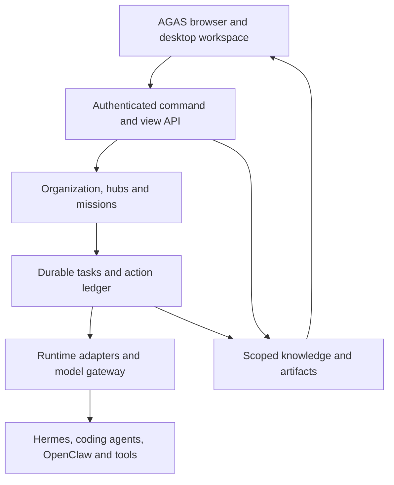
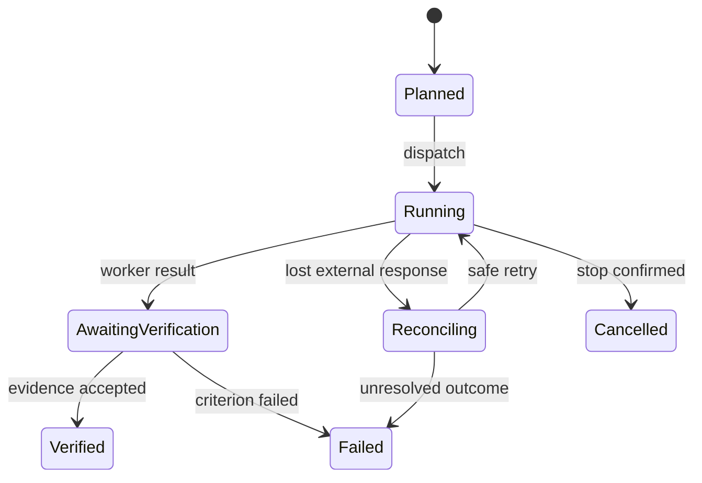

# AGAS native platform — architecture decision and implementation path

**26 September 2026 · proposed v3 direction · Raghunath D**

AGAS means **Accessible General AI System**. This decision responds to hands-on review of the `rebuild/agas-foundations` preview. It supersedes the earlier decisions to make AionUI the product shell and Paperclip the organization authority. It preserves the goals in the master plan: one persistent organization with seven hubs, real agents, scoped knowledge, verifiable work, an accessible JARVIS-inspired workspace, and an eventual installable Linux environment. The existing main branch and draft AionUI/Paperclip rebuild remain available as recoverable reference points. This document describes a new build; it is not a claim that the system already exists.

## 1. What the review established

| Observed in the user's preview | Consequence |
|---|---|
| AionUI has **Assistants** with enabled, custom and official lists, icons, rules, skills and backend selection. | A second AGAS assistant list should not compete with it. AGAS needs one canonical assistant identity and a single well-designed card system. |
| Its local-agent screen already finds available CLIs, including Hermes and OpenCode. | Discovery is a platform capability, not a second catalog of hard-coded agent names. A native AGAS will need its own single discovery service or a compatible adapter; it should not show a duplicate detection panel. |
| The new **AGAS Agent UI → Agency catalog** exposes 279 source prompts as large text rows. | A prompt template is not a running agent. Import the 279 as searchable, sourced templates; activate only selected roles into hubs with backend, skills, permission scope and icon. |
| The **Native apps** tab in the browser says it requires the desktop application. | The browser cannot depend on Electron views for essential AGAS tasks. Core organization, missions, agents, artifacts, approvals and results must work in the browser. Native clients can add optional terminal and desktop surfaces. |
| Paperclip runs on a separate local address, while the preview's AGAS navigation has no working organization board. | AGAS needs its own visible organization/mission workspace. Starting Paperclip as a background process is not equivalent to integrating its decisions and state. |

The preview proved service startup and branding, but not real cross-hub missions, persisted delegation, durable recovery, or the final user workflow. Passing old simulator tests or displaying 279 entries does not close those gates.

## 2. Product and ownership decision

Build an original AGAS application and control plane. AionUI and Paperclip are **reference implementations and optional import/integration sources**, not required runtimes and not upstream UIs embedded as AGAS's primary interface. Keep their license notices with any imported code; default to original product code and normal protocol/API integrations. Pin external dependencies and adapters separately.

AGAS has **one authoritative organization and mission engine**. Agents, models and external products cannot independently declare a mission accepted, expand their own permissions or mark a real-world action complete. An external Paperclip organization, if a user connects one, maps into AGAS through an explicit import/read projection or delegated sub-workflow. Avoid two writable copies of the same goal or task; no automatic two-way sync until conflict and identity rules are demonstrably correct.

The system starts as a single-user, local-first application for Ubuntu/Linux with a browser workspace and a companion desktop shell when native terminals and OS integration are needed. An authenticated always-on host is a later deployment profile. Omarchy/Hyprland/Quickshell integration and a bootable distribution are later packaging stages, after the application works on a normal Linux desktop.

## 3. Logical architecture

Start with a modular server and separate worker process, rather than a fleet of microservices. Ordinary commands use versioned HTTP APIs; the UI receives events over SSE or WebSocket. A committed database row and transactional outbox are the durable source of events; a socket update is a projection. Start with a single-host relational database and a versioned object/artifact directory. If concurrent hosts become necessary, move authoritative records to PostgreSQL with a tested migration. Search indexes are rebuildable projections. Add a durable workflow engine only when the native job engine fails measurable recovery or scale requirements.

### One source of truth per object

| Object | Authoritative owner | Important invariant |
|---|---|---|
| Organization, seven hubs, goal, project, roster and budget | AGAS organization module | One stable ID and optimistic revision; every member belongs to a scope. |
| Mission, task DAG, run/attempt and acceptance | AGAS mission module | Idempotent intake; no completion without criterion-specific evidence. |
| Agent installation and capability health | Runtime registry and adapter | “Detected”, “authenticated”, “ready” and “running” are distinct states. |
| Assistant definition | AGAS registry | A persona/template plus selected runtime, tools, model, skills, icon and version. |
| Native conversation | The connected runtime | AGAS stores a scoped session handle and referenced outputs, not a merged transcript. |
| Tool permission, credentials and external side effects | Action broker and domain service | Validate scope at execution time; record receipt or uncertain outcome. |
| Artifact and approved memory | AGAS artifact/context service | Provenance, access scope, revisions and content hash. |
| Actual business, finance or health records | Their domain service | General chat memory is not an authoritative ledger. |

### Agent vocabulary and presentation

- **Runtime:** a real executable/service, such as Hermes, OpenCode or a local model worker. Adapter discovery checks version, authentication and supported capabilities. ACP is useful when a given runtime implements it; other runtimes require documented native adapters.
- **Template:** an Agency prompt or original AGAS role definition with provenance, source license, version, category and icon reference. Templates do not consume resources or imply skill by themselves.
- **Assistant:** a versioned configuration binding a template to an eligible runtime, model, tools, skills, knowledge scope and permissions. One assistant can be available for chat without permanent hub membership.
- **Hub member:** an assistant assigned a responsibility, budget, reporting rule and handoff contract in one of seven permanent hubs. Membership does not start a model loop.
- **Run:** one bounded execution with input snapshot, worker/session ID, deadline, budget, trace, result and verifier evidence.

Use a single searchable **Agents** area with filters for Installed, Assistants and Template library. Cards show a distinct verified icon or generated AGAS category mark, name, role, backend, availability, version and trust/status. Provide list and compact card modes, keyboard navigation, accessible names and actual error details. Do not make 279 nearly identical assistants on first start; keep all 279 templates searchable, and create selected assistants through a clear configuration flow.

## 4. Organization and seven hubs

One AGAS organization owns these permanent hubs: **Dev**, **Content**, **Finance**, **Business**, **Family Health**, **Authorized Security**, and **Management/Maintenance**. Every hub shares mission infrastructure and versioned knowledge contracts, but owns its domain rules, private data and acceptance tests.

The **Organization** screen contains a goal tree, hub board, role roster, budgets, shared dependency map and current blockers. Each hub has an overview, mission queue, assistants/roles, knowledge, artifacts, tools, evaluations and settings. Cross-hub handoff carries an accepted artifact ID, scope and recipient acknowledgement. A specialist is awakened by a task, not run continuously to maintain the appearance of autonomy.

The first genuinely complete slice is **Dev Hub**: intake a repository objective with acceptance criteria; produce a bounded plan; execute with one real coding runtime in an isolated worktree; capture changed files, test output and artifact hashes; verify each criterion; handle cancellation and restart; show every step in AGAS. The other hubs get genuine organizational records and screens before specialized execution is added. Business then proves a real booking/record workflow; Content proves a sourced draft and review; Finance begins with reproducible research and paper mode. Domain production actions get their own later acceptance gates.

## 5. Execution contract

Create a mission from objective, hub, owner, input references, acceptance criteria, scope, budget and deadline. A task has a stable ID, dependencies, runtime/capability requirements and an idempotency key. A worker claims a task with a lease and fencing token. Checkpoints and outbox events commit together. On crash, a new worker reconciles the old attempt before replaying a side effect. An unknown external outcome remains **uncertain** until observed; the UI must not turn that into success or a clean cancellation. Capture actual tool outputs and independent receipts; generated summaries alone do not prove completion.

Models choose among **eligible** tools and propose actions; code enforces permission, domain rules and budget. Approvals bind to an exact action/version. The operator can stop new work even when model services fail. No shared secret is put in a retrieved document or general memory index. Sensitive hub contexts stay separate.

## 6. Interface structure

| Surface | First useful screen | Live source |
|---|---|---|
| Home / Mission Control | Active objectives, blocked work, accepted outcomes, spend and incidents | Missions, evidence and usage records |
| Organization | Goal tree, seven hub cards, roster and dependencies | AGAS organization module |
| Agents | Installed runtimes, configured assistants, source templates with unique icons | Runtime registry and assistant definitions |
| Hub workspaces | Domain-specific queue, tools, artifacts and evaluations | Hub services and scoped missions |
| Mission detail | Plan, tasks, run timeline, receipts, criterion-by-criterion verification | Mission and action ledger |
| Knowledge | Search, source graph, versions and permissions | Context and artifact service |
| Approval inbox | Exact proposed effect, scope, destination, evidence and expiry | Action broker |
| Settings / diagnostics | Backend auth, capability test, providers, data, backup and health | Adapters and host |

Navigation has a slim permanent rail, one main work surface and a collapsible evidence/operations inspector. The finalized AGAS logo and attribution remain. Use dark, legible surfaces with restrained cyan/amber accents and distinct hub icons; the user can choose a calmer light theme. Maintain focus/operations/spatial/ambient layouts over one object identity, and make all essential work available by keyboard and in the browser. Native terminal, window and gesture modes extend that core. Voice first provides visible listen/understood/acting states and cancellation; advanced multimodal interaction follows verified workflows.

**Example:** a user selects Dev Hub, opens a mission, assigns a real assistant, watches a live task/run and inspects changed files. Another hub can receive an accepted artifact reference, never a silently copied private memory. After a server restart, the same mission, run history and view return, including unresolved effects.

## 7. Performance and intelligence are measured outcomes

Compare AGAS with the current AionUI/Paperclip preview and a single-agent baseline on the **same tasks and hardware**. Record task acceptance rate, correction rate, developer intervention, cost, p50/p95 time to first visible response and verified completion, CPU/RAM idle load, duplicate side effects, crash recovery and role/hub usability. A second agent or review panel runs only when it measurably improves a task. Prompt length is reduced by scoped context packets with source links, not by stripping error evidence. Use cached views and deterministic handlers for cheap interactions; schedule expensive inference and GPU work separately. The presence of many named agents or a polished HUD is not a measure of intelligence.

The proposed pilot goals from the master plan—visible local acknowledgement p95 <150 ms, cached view p95 <500 ms, and reliable restart recovery—are targets for a specified machine and fixture, not current measurements. Build an evaluation set containing Telugu, Hindi, English and mixed-language examples for relevant hubs. Protect against regression when prompts, tools, models or workflows change.

## 8. Build order and release gates

1. **Architecture and branch:** isolate this build from `main` and the AionUI PR; inventory imported data and licenses; document authority, IDs, contracts, threats and target Ubuntu profile.
2. **Native shell and store:** original AGAS browser UI with identity, goal/hub/assistant/mission objects and persisted transactions; one coherent icon system. No mock completion counts.
3. **One real vertical slice:** runtime discovery with readiness checks, one real coding adapter, bounded dispatch, actual artifacts and evidence verification. Prove kill/restart, duplicate dispatch, cancellation, permission changes and recovery.
4. **Organization and second worker:** permanent rosters, hub-to-hub handoff, scoped context and a second runtime. Require recipient acknowledgement and context isolation.
5. **Seven hub expansion:** deliver domain screens and workflows one by one with their own real data and acceptance checks. Start finance in research/paper mode and business with a real testable record process.
6. **Desktop, voice and OS:** add packaged native terminal/OS integration, voice and accessible multimodal controls, then an Omarchy overlay and clean-machine installer. Test backup/restore, upgrades and dependency licenses.

Each gate has an executable fixture and a written result. A development preview can ship early; a full release waits until the mission, data, installer and user-workflow gates pass. No accuracy, intelligence or latency advantage is claimed without the comparison in section 7.

## 9. Migration and repository safety

- Keep `main` and draft PR `rebuild/agas-foundations` intact until the new implementation passes its gates. The old branch's AGAS logo, Agency provenance manifest, useful tests and adapter research can be copied or rewritten with attribution; the AionUI UI and Paperclip server do not become boot requirements.
- Offer a **one-way, previewable import** of existing AionUI assistant rules/configuration and Paperclip goals/issues later. Map external IDs, show conflicts and never silently overwrite AGAS records. Existing application data is not deleted.
- Maintain a compatibility map for user-installed runtimes and provide migration tests from legacy AGAS records. Do not report simulator output as evidence of an actual mission.
- Create a new draft PR for the native path. Merge or retire an older implementation only when the owner can inspect a working replacement and its import/export, backup and rollback evidence.

The next code change should be the first original AGAS vertical slice, with real persistent organization and mission records. A merely branded dashboard or another 279-row list would repeat the observed failure.
