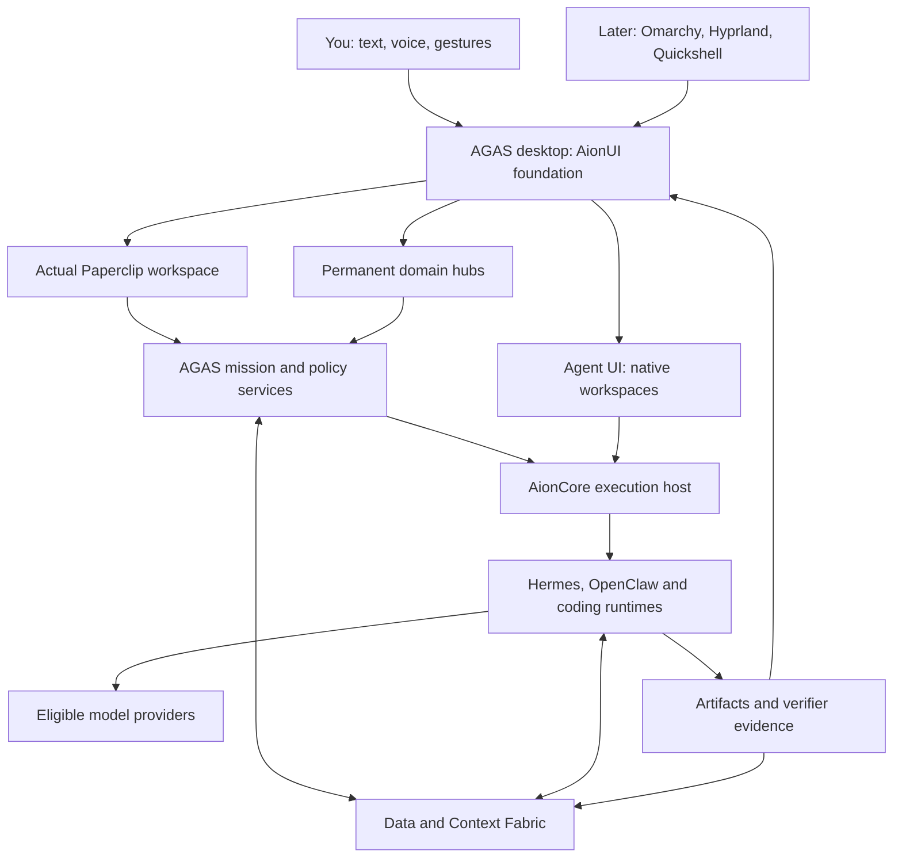
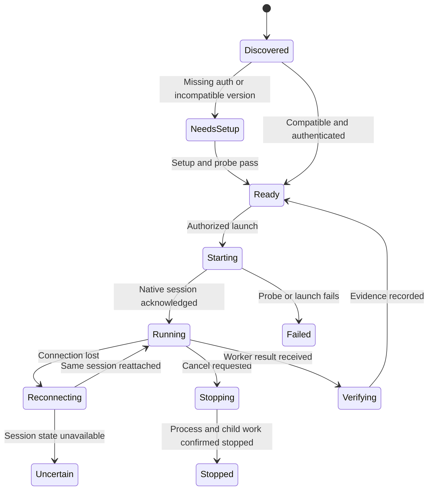
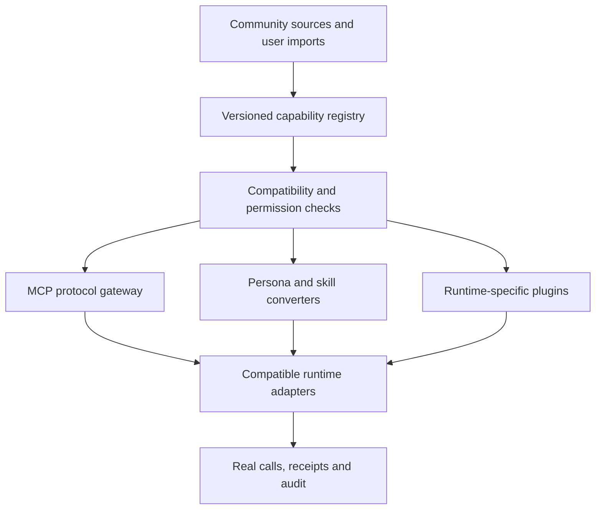
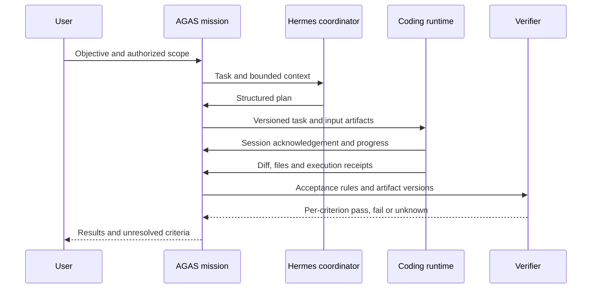

# AGAS — rebuild architecture and approval plan

**Prepared for Raghunath · 25 September 2026 · Proposal v2 · Awaiting approval**

AGAS means **Accessible General AI System — BY RAGHUNATH.D**. This proposal preserves the user’s requested AionUI-derived desktop, adds Agent UI, embeds the real Paperclip workspace, connects real agent runtimes, and builds permanent specialist hubs over shared data and model services. The eventual product remains an Omarchy/Hyprland/Quickshell operating environment with a dynamic JARVIS-style interface.

This is a reviewable implementation plan, not a claim that the product is finished. No remote repository, branch, file or release was changed during this review. MBAs remains a separate project.

## 1. Decision requested

Approve a **replacement implementation branch in the existing `rowdy9941/AGAS` repository**, preserving the present commit and history. Replace the custom browser console as the product foundation with the actual AionUI application. Integrate actual AionCore and Paperclip. Port only reviewed, useful prototype concepts and tests. Keep simulators exclusively as labeled development fixtures.

Do not delete the GitHub repository, erase its history, force-push main, remove unrelated projects, or overwrite user databases. The current implementation can be removed from the new branch after its useful work is assessed and recovery is secured. That achieves a clean rebuild without losing evidence.

Approval of this document authorizes implementation work, branches and reviewable pull requests for the described scope. It does not authorize a public production launch, deletion of user data, purchases or unrelated repository changes. Subsequent build progress is measured against the acceptance matrix in section 23.

## 2. Current repository: verified findings

Reviewed repository: [rowdy9941/AGAS](https://github.com/rowdy9941/AGAS), `main` at **`0a606589bc117be40f0088bac99e7c008ce0dd51`**, version 1.0.1. The tree contains **67 tracked files**. Nine pull requests were merged. GitHub Actions reported success for the reviewed head. I cloned that snapshot, inspected the core implementation and tests, and ran `npm run check` locally: **35 tests passed** on Node 24.19.0.

Those passing tests do not establish your requested MVP. The repository implements a different, narrower product.

| Requirement | Actual reviewed implementation | Assessment |
|---|---|---|
| Preserve and extend AionUI | Standalone HTML/CSS/JavaScript operator console | Wrong UI foundation |
| Integrate AionCore | No AionCore source or packaged backend in this tree | Missing |
| Embed Paperclip | Custom organization/project/team records described as “Paperclip responsibility” | Substitution, not integration |
| Correct AGAS expansion | Package description says “Agent Governance and Activation System” | Branding differs from your chosen name |
| Native agent interfaces | Batch subprocess runner using pipes; no native embedded workspaces or PTY in reviewed implementation | Major missing capability |
| Managed runtime installation | Runtime manager only marks bundled `agas-sim` installed | No external runtime installer |
| Hermes/OpenClaw execution | Catalog entries have discovery commands, but no execution definition used by local executor | Listed, not executable through this runner |
| Coding execution | Codex/Claude/OpenCode command definitions; local mode selects the first runtime assignment | Limited batch integration; no full native lifecycle |
| Agency catalog | Eight starter personas with short AGAS-authored prompts | Not the reviewed 279-persona upstream catalog |
| Shared MCP | Registration, tool-grant records and custom JSON projections | No protocol-serving/execution gateway in reviewed module |
| Cross-agent handoff | Handoff records created and immediately accepted by mission code | No demonstrated recipient acknowledgement/context consumption |
| Acceptance verification | Checks completed tasks, artifact IDs and nonempty criteria; then checks off all mission criteria | Can claim success without checking the requested outcome |
| Persistence | SQLite WAL, JSON namespace snapshots, migration and backup helpers | Useful prototype foundation, needs transactional redesign for production workflows |
| Obsidian | Markdown export and artifact import | Useful starting behavior; not complete graph/synchronization design |

The strongest reproducible problem: an offline mission with the criterion **“A real signed external receipt must exist; simulation does not satisfy this criterion”** still returned `completed`, `verification: true`, and marked that criterion checked. No receipt was produced. This was a temporary local probe; it changed no repository files.

Additional code limitations to address: the dispatcher does not pass an abort signal to the executor, so a cancelled record is not proof that its child process stopped; the local executor sends the objective without assembling the planned persona, shared evidence and MCP policy into a runtime context; vault import does not compare the incoming version against the current artifact version; startup rewrites built-in catalog entries over persisted entries. These are findings from inspected paths, not a complete security audit.

The repository README says all seven MVP phases are implemented. Its offline acceptance test substitutes a simulator, custom organization records and an invalid/non-contacted MCP endpoint for key integrations. That test is useful for internal state transitions, but must not serve as the product release gate.

### Keep, adapt or replace

| Existing part | Proposed treatment |
|---|---|
| Git repository, history and audit evidence | Preserve |
| Registry vocabulary and validation cases | Adapt to versioned typed contracts |
| Memory-scope and isolation test cases | Retain intent; run against the new authorization model |
| SQLite backup/migration concepts | Retain where appropriate; do not assume existing schema is final |
| Artifact/handoff/vault concepts | Adapt with immutable versions, recipient acknowledgement and conflict checks |
| Browser console | Retire as main product; optionally retain only as internal diagnostic reference |
| Custom Paperclip replacement | Retire from active organization ownership |
| Simulator | Move into explicit test fixtures, excluded from real completion evidence |
| Runtime manager and batch executor | Replace/extend through actual AionCore-backed adapters and managed installers |
| Automatic “verified” reporting | Replace with criterion-specific verifier results |
| 1.0.1 completeness claims | Preserve historically; label rebuild as preview until gates pass |

## 3. Existing foundations and source evidence

The user’s AionUI fork currently points to `6744099b279b991c17e31c243f0920477bd31cb6`, package version 2.2.2. Its manifest includes Electron/React/TypeScript, ACP and MCP dependencies, desktop packaging, WebUI and tests. It declares `aioncoreVersion: v0.2.2`.

The user’s AionCore fork currently points to `c42ad812191ad6148280662088caaee0b33e57f0`. Its architecture describes Rust/Axum/Tokio/SQLite, HTTP/WebSocket interfaces and domain modules for sessions, processes, teams, MCP, extensions, projects and agents. **Do not assume this current head is the exact backend compatible with AionUI’s v0.2.2 pin.** Establish a tested pair before importing.

Fresh upstream documentation checks also found:

- Paperclip describes a Node/React server/UI, organizational workflows, a durable heartbeat queue and embedded PostgreSQL for local operation. Its checked package manifest requires Node 24.11+ and uses pnpm. Preserve those boundaries rather than flattening its packages into AionUI’s dependency graph.
- Hermes desktop documentation describes an Electron shell, a native React surface and a headless agent backend using `serve` and a JSON-RPC/WebSocket gateway. A browser view is not automatically equivalent to its entire desktop shell; native bridges and platform packaging need an integration spike.
- The pinned Agency Agents Hermes integration explicitly reports 279 generated agents and lazy search/inspect/load/delegate tools. Import that reviewed snapshot and record the actual count; do not hardcode 279 as an eternal catalog size.
- Electron documents WebContentsView and isolated content surfaces. Embedding is feasible, but authentication, navigation, permissions and native bridges still need implementation.

This review did not build every upstream project or audit every source line. Runtime commands, distribution terms and OS compatibility must be checked against the exact selected releases before packaging. Source references and inspected pins are in section 26.

## 4. Product contract: what stays fixed

1. AGAS is independent of MBAs.
2. Use the finalized AGAS logo and attribution; derive small icons from the real asset.
3. Preserve the recognizable AionUI layout and useful functionality.
4. Add **Agent UI** to the existing sidebar.
5. Preserve native agent surfaces wherever supported; expose fallbacks honestly.
6. Embed actual Paperclip, not a lookalike organization table.
7. Deliver one product repository and installer with bundled core services and optional managed runtimes.
8. Separate persona, agent identity, runtime, model, tool, skill, plugin and workflow.
9. Make hubs permanent configurations with on-demand worker activation.
10. Share context through scoped contracts while preserving native memories.
11. Support an organized Obsidian knowledge view.
12. Keep the original seven domain hubs and the later OS/JARVIS destination.
13. Do not report simulation, interface mockups or catalog records as working integrations.

The first release profile is a personal, local-first desktop with optional API inference and remote workers. Linux x64 is the proposed first end-to-end packaging target because it leads toward your OS destination; Windows and macOS remain architecture targets and later release gates. Exact release order is adjustable at approval without changing the system contracts.

## 5. Whole-system architecture

Your three functional layers remain intact: autonomous hubs, data/context, and model intelligence. The desktop, execution/authority services and eventual OS support them.



The diagram represents target integrations. Runtimes are not all forced through one identical provider API. AGAS records and constrains provider eligibility; each adapter uses its supported native configuration and exposes unsupported controls.

## 6. Authority and state ownership

| State or decision | Authoritative owner | Boundary |
|---|---|---|
| Companies, roles, goals, issues, assignments and organizational budgets | Paperclip | AGAS stores external IDs and projections, not competing writable copies |
| Accepted mission contract, task DAG, run state, verification and recovery | AGAS mission service | A Paperclip issue maps to one mission identity; retries attach to it |
| Native conversation and runtime session | Corresponding runtime/AionCore session service | AGAS stores handles and authorized selected context |
| Process lifecycle, terminal and native host operations | AionCore-backed runtime host | One designated process owner; no duplicate launches |
| Permission and action authorization | AGAS policy/action service | Intersect user, workspace, mission and capability grants |
| Shared knowledge/provenance and artifact metadata | Context Fabric | Indexes and Obsidian are derived views |
| Domain facts such as portfolio state or family observations | Domain service | General semantic memory is not the ledger |
| Workspace layout and selected object | AGAS workspace state | Shared across views without becoming execution authority |

Paperclip’s organizational wakeup enters an AGAS adapter using a stable mission ID. Repeated wakeups query or resume that mission. AionCore teams and Hermes delegation execute bounded child work. Native cron triggers enter the same intake contract for managed missions. This avoids several independent managers running the same objective.

**Durable execution decision:** begin with a single-host transactional job state machine alongside the AionCore foundation: relational records, leases, checkpoints, outbox, bounded retries and reconciliation. Do not port the prototype’s separate snapshot writes unchanged. Temporal is deferred for the distributed/long-running expansion profile; it is not an additional competing scheduler in the first desktop package. If the initial implementation cannot pass recovery gates, revise this decision before expanding scope.

## 7. Repository structure and languages

One repository does not require one package manager. Preserve upstream build islands and exact lockfiles. Use top-level scripts to orchestrate them.

| Directory | Contents |
|---|---|
| `foundations/aionui/` | Pinned AionUI source, preserved layout and minimal AGAS patches |
| `foundations/aioncore/` | Tested backend source and focused host/domain extensions |
| `foundations/paperclip/` | Pinned Paperclip source with its own package graph and notices |
| `packages/contracts/` | Versioned API/event/manifest schemas and generated clients |
| `packages/desktop-integration/` | Agent UI navigation, surface descriptors, deep links and shell integration |
| `packages/adapter-sdk/` | Runtime lifecycle and capability contract |
| `integrations/` | Hermes, OpenClaw, coding runtimes, Paperclip and catalog conversion adapters |
| `services/agas/` | Mission, policy, context, registry and projection modules; initially a small number of processes |
| `catalog/` | Source-pinned personas, tools, skills, workflows and trust metadata |
| `hubs/` | Seven domain templates and user-defined hub schemas |
| `runtime/` | Compatibility lock, downloadable packages, checksums and ownership records |
| `brand/` | Original logo, optimized derivatives, brand policy |
| `os/` | Later Omarchy overlay, Quickshell components, installer and recovery definitions |
| `evals/` | Real user scenarios, failure injection and quality/cost baselines |
| `tests/fixtures/` | Explicit simulators and fake tools, excluded from real capability claims |
| `infra/` | Cloud development, build/cache workflows, signing and packaging |
| `docs/` | Requirements, decisions, evidence, source inventory and runbooks |

Use TypeScript/React for desktop extensions and integration code, Rust for the existing AionCore runtime host and appropriate domain extensions, and Python only where a domain workload needs its ecosystem. QML belongs to the later native OS shell. Do not add another language-specific service solely to match an old diagram.

Bring selected foundations into the monorepo through a tracked import/subtree process with upstream SHA, license, import script and patch ledger. Optional runtimes remain managed release artifacts or user installations. AGAS should build from its locked sources without requiring users to clone unrelated repositories.

## 8. Desktop information architecture

Preserve AionUI’s existing sidebar items: New Chat, Search, Scheduled Tasks, Teams, Projects, Conversations and Settings. Add **Agent UI**. Place the new catalog and runtime surfaces there. Extend Teams with Hubs rather than immediately replacing all navigation with seven new dashboards.

| Surface | Behavior |
|---|---|
| Existing Home/Chat | Existing useful AionUI experience, AGAS name/logo |
| Agent UI → Installed | Runtime cards with detected/managed/remote status and real capability state |
| Agent UI → selected runtime | Its native view, terminal or explicitly labeled companion window |
| Agent UI → Paperclip | Actual Paperclip application in a full working region |
| Agent UI → Catalog | Personas, skills, tools, MCP and plugins with source/version/compatibility |
| Teams → Hubs | Permanent roster, responsibilities, workflow canvas and evaluations |
| Projects → Mission | Plan, tasks, evidence, changed files and verification |
| Search → Knowledge | Authorized project memory, artifacts and linked sources |
| Settings | Providers, runtimes, permissions, updates, data and diagnostics |

A thin context header displays current project, selected runtime and whether this is a managed mission or manual session. An optional right inspector shows context, permissions, artifacts and usage. It collapses when an embedded product needs width. Existing native interface controls remain visible.

The accompanying HTML contains conceptual wireframes, clearly marked as proposals. They are not screenshots of a built product and do not invent a replacement for your finalized logo.

### Screen 1: Agent UI

Left: preserved global sidebar. Next: installed-runtime list. Center: the selected native surface. Optional right: AGAS context inspector. Controls: open, reconnect, stop managed session, focus and pop out. A missing runtime displays installation guidance instead of an empty fake chat.

### Screen 2: Hub Builder

Left: searchable specialist catalog. Center: roster and workflow stages. Right: selected member’s runtime, permissions, memory, budget and handoff rules. Dragging adds a stable membership; it does not launch work. Provide keyboard “Add to hub” and move controls. Validate missing runtimes, dependency cycles, unsupported tools and absent acceptance rules before enabling a workflow.

### Screen 3: Mission workspace

Center: real task progress, artifact and diff/preview. Inspector: criterion-by-criterion evidence. Show “process finished,” “awaiting verification,” “verified,” “failed” and “outcome uncertain” separately. Approval requests include a concrete action and scope. Never mark all criteria checked from an agent’s summary alone.

### Screen 4: Knowledge and vault

Search results expose source, freshness, scope, confidence/trust status and version. A linked view connects missions, people, artifacts and decisions. The graph supplements readable lists/tables; it does not hide information in decorative 3D.

## 9. Native surfaces and desktop security

Use Electron WebContentsView for compatible embedded web applications, with isolated sessions, disabled Node integration for embedded content, context isolation, restricted navigation/IPC and controlled external links. Size and focus follow the content region. Close or suspend unused surfaces to limit memory use.

Use a real PTY for interactive terminal applications. A pipe-based batch command is a separate execution mode and must be labeled accordingly. Resize, Unicode, reconnect, keyboard input, cancellation and terminal escape handling need real integration tests.

Hermes desktop embedding requires a prototype because its renderer can depend on Electron-native bridges. Preferred path: use its supported web/shared renderer where it preserves required functions; otherwise maintain a full companion window. Do not claim the companion window is embedded. OpenClaw connects to its actual gateway and supported control surface.

Browser/WebUI remote mode cannot use Electron-only embedding. It uses supported browser surfaces or controlled external links; an authenticated remote host owns execution and filesystem access. Do not imply a remote terminal operates on the display device.

**Manual mode:** user directly operates native tools; AGAS reports the integration’s actual visibility. **Managed mode:** AGAS owns the task envelope, scoped credentials and permitted capabilities. Native tools capable of bypassing policy cannot be silently advertised as fully governed; restrict their environment, use supported hooks, or expose the limitation.

## 10. Runtime lifecycle and adapter contract



Adapters expose detect, probe, authenticate, start, attach, send, interrupt, stop, status, events, artifacts, usage, optional resize, install/update and rollback support. Capability descriptors identify supported modes, versions and policy enforcement depth.

Runtime installations have an owner: user, AGAS, system package manager or remote host. AGAS must not let two updaters mutate the same installation. Managed versions live in separate versioned locations; user configuration remains outside package payloads. Update existing user-owned agents only under the user’s selected policy.

Credential setup uses native supported flows and scoped secret references. Do not copy a developer’s login into an installer or assume every provider subscription permits programmatic use. Model/runtime availability and provider authentication are different checks.

## 11. Persona, agent and hub construction

Import the actual pinned Agency catalog, retaining original content, division, source SHA, license and conversion version. Show every imported definition; enable real execution only for tested runtime/format combinations. Role prompts are specialist instructions, not independently trained experts.

An **agent instance** binds a persona version to a persistent organizational identity, preferred runtimes, model policy, memory scope and permission envelope. A **run** is one activation of that identity. A **hub** owns a versioned roster and workflows. Changing a persona does not silently mutate running tasks; runs keep their original version reference.

```yaml
hub_id: development
version: 1
members:
  - agent_id: architect
    persona_ref: agency/software-architect@pinned
    preferred_runtime: hermes
    fallback_runtimes: [codex]
    memory_scopes: [project, mission]
  - agent_id: implementer
    persona_ref: agency/backend-architect@pinned
    preferred_runtime: codex
    memory_scopes: [project, mission]
workflow_ref: workflows/implement-reviewed-change@1
policy_ref: policies/development-workspace@1
```

This is an AGAS contract example; actual imported slugs are resolved from the catalog rather than invented during implementation. A fallback must preserve capability and privacy requirements and show the changed assignment.

## 12. Registries and universal MCP

Ten resource kinds: Runtime, Agent, Persona, Skill, Tool, MCP, Plugin, Workflow, Model and Hub. Every record carries source, version, content hash, license, compatibility, dependencies, permissions, ownership and lifecycle state.

Lifecycle: discovered → inspected → quarantined/tested → approved → enabled → deprecated/revoked. Catalog browsing never executes an install script. Pin downloads, inspect dependencies and test with restricted credentials before promotion.



The MCP gateway must actually negotiate protocol sessions, discover tools, validate schemas and forward allowed calls using supported transports. Support stdio and Streamable HTTP for the selected protocol version; add legacy transport compatibility only where required by tested clients. Configuration projection alone is not a gateway.

Use a scoped runtime/session identity for every invocation. Compute effective permissions from user, workspace, mission, agent and tool grants. Filter discovery and enforce the same rules at execution. A denied direct call must remain denied even if a client knows the tool name. Tokens are not placed in exported configuration or Obsidian.

Importing an MCP configuration from a runtime requires previewing its source, credentials and scope; do not silently edit every native config. Plugins retain runtime compatibility restrictions. A universal registry manages them, but does not turn one runtime’s hooks into another’s APIs.

## 13. Data, Context Fabric and storage

Use existing AionCore storage for native sessions and platform state. Add AGAS-owned relational tables through its supported domain/repository patterns, with clear migration ownership. Paperclip retains its own PostgreSQL database and migration authority. Never join by directly updating a vendor’s private tables.

For the first single-host profile, AGAS operational state can use SQLite with explicit transactions, relational constraints and a single authoritative writer. This differs from the current repository’s independent JSON namespace snapshots. Keep a repository interface so a server profile can move AGAS state to PostgreSQL when concurrent workers require it. Do not promise transparent migration without tests.

| Data class | Proposed handling |
|---|---|
| Mission/task/action/job state | Transactional AGAS tables with version checks and outbox |
| Organizations and assignments | Paperclip-owned PostgreSQL |
| Native chats/sessions | Native runtime/AionCore stores, referenced by handles |
| Artifacts and raw observations | Versioned filesystem/object-store interface; content hashes |
| Knowledge | Source-linked records and chunks; full-text first, measured semantic index second |
| Relationships | Entity/edge tables with evidence and validity |
| Domain research | Versioned datasets, Parquet when appropriate |
| Secrets | OS-backed secret store or encrypted service; never a search index |
| Obsidian | Authorized knowledge projection and reviewed imports |

Canonical entities include Person, Organization, ChannelIdentity, Workspace, Project, Mission, Task, Agent, RuntimeSession, WorkflowRun, ArtifactVersion, MemoryRecord, Source, Approval and ActionReceipt. Keep original IDs and source-system mappings.

Ingestion captures raw source/version, validates schema/units/time, records provenance, normalizes entities, assigns permission/retention, and only then indexes. Separate observations, interpretations, predictions and user instructions. Identity linking needs evidence and reversible merges; matching names alone is insufficient.

Start with repository files, project documents, mission outcomes and selected research sources. Add OpenBB/WorldMonitor-style feeds through source-specific connectors and quality checks when their hubs need them. Their integration does not create unlimited free data or unrestricted redistribution rights.

## 14. Memory and the Obsidian vault

Scopes: private agent, session, mission, workspace/project, hub, personal, organization and approved shared knowledge. Content kinds include episodes, facts, procedures, preferences, entities and artifact references. A record carries author, source, observation time, validity, sensitivity, permissions, version, supersession, expiry and deletion state.

A task receives a bounded context packet: objective, assigned role, constraints, relevant decisions, source-backed knowledge, artifact versions, permitted tools, budget and output contract. Native memory is retained. Shared context does not mean merging model weights or exposing all transcripts.

Vault folders: `00-System`, `10-People-and-Organizations`, `20-Projects-and-Workspaces`, `30-Missions`, `40-Hubs`, `50-Agents-and-Personas`, `60-Workflows-and-Skills`, `70-Knowledge`, `80-Artifacts`, `90-Decisions-and-Evidence`, `99-Archive`.

Each projected note has canonical ID, source version, content hash and export scope. Human edits submit an import proposal with the base version. A concurrent edit produces a conflict, not last-writer-wins. Deletion/supersession propagates to indexes and exported views. Export does not include secrets or content whose access controls the vault cannot preserve.

“Holographic memory” means linked, multidimensional knowledge views. Start with searchable lists, timelines and relationships; add a spatial graph when it improves navigation. Source authority remains in the underlying records, regardless of visual presentation.

## 15. Agent-to-agent workflow



A handoff has an ID, mission/task/run IDs, sender/recipient, artifact versions, objective, constraints, policy, budget, acceptance contract, deadline and reply target. Sender creation, broker delivery and recipient acceptance are separate events. Deduplicate by handoff ID and reject stale artifact versions where required.

Independent tasks can run concurrently with separate worktrees and explicit ownership. Same-file edits require integration ownership. A downstream task must demonstrate it received and used the referenced inputs; inserting two runtime names into a database is not a cross-runtime test.

## 16. Verification, recovery and honest status

Every criterion gets a verifier type and required evidence before execution. Examples: build command exit/log, test case, expected file hash, browser interaction, external receipt, user review or source citation. Criteria that require judgment can use model review, but should expose its evidence and uncertainty.

Results are `pass`, `fail`, `unknown`, `not_run` or `not_applicable`. Only required passing criteria permit verified completion. A process exit of zero is one observation, not proof of the overall mission. Simulated results carry `execution_mode: simulated` and cannot satisfy a real-effect gate.

Persist task claim, lease, run ID, attempt and event in one transaction. Record output artifacts before announcing completion. Retry only classified retryable failures. Track external action IDs and idempotency keys; after a lost response, reconcile external state before repeating the action. Cancellation remains “stopping” until the process group and outstanding effects are accounted for.

On restart, inspect owned sessions/processes and durable checkpoints. Reattach where supported; otherwise report an interrupted step and determine whether retry is safe. Budget reservation and settlement are distinct. Provider fallback cannot silently violate data policy or native session semantics.

Backup covers AGAS records, Paperclip state, artifacts, vault metadata and a version manifest at a consistent checkpoint. Restore is tested on a separate profile. Uninstall removes application payloads only; data removal is a separate explicit action.

## 17. Original seven hubs and domain workflows

| Hub | Main workflow | First useful release | Expansion |
|---|---|---|---|
| Development | Brief → architecture → isolated implementation → tests → review → release artifact | Real repository change with evidence and restart recovery | Multiple stacks, deployment, measured skill reuse |
| Content | Sources → audience brief → writing/storyboard → media → editorial review → authorized publication → analytics | One complete niche workflow | Many niches/accounts as configurations with bounded workers |
| Finance | Data → hypotheses → reproducible research → validation → paper operation → reconciled execution | Research and paper trading only | Separately enabled broker/venue execution and portfolio operations |
| Business | Product release → operations setup → customer intake → validated transactions → support → metrics | One independently specified product operation | Multiple businesses with isolated records and credentials |
| Family Health | Consented records → measurements/routines → trends → reminders/summaries | Private records, reminders and summaries | Validated device connectors and care coordination |
| Authorized Security | Asset scope → assessment → reproducible findings → remediation → retest | Owned lab/staging target | Broader authorized coverage and continuous monitoring |
| Management/Maintenance | Telemetry → incident → recovery → proposed improvement → evaluation → rollout | Process/data health, cost and recovery | Compatibility research, resource scheduling and tested learning |

Command and Knowledge are shared platform capabilities, not replacements for these domains. Custom hubs can be created from the same manifest system. Business capability remains independent of MBAs. Security work stays within owned/authorized targets; health support does not silently become autonomous clinical treatment.

The MVP makes Development and Management/Command genuinely operational and offers the other hub templates with explicit capability status. A template is not a completed finance/content/health product. Broader hub maturity follows its own data, tools and acceptance gates.

## 18. Model intelligence and learning

Route by data permission, task capability, tested quality, latency, cost and availability. Support cloud and local models through native runtime capabilities and an AGAS provider policy layer. Do not force all runtimes to accept the same model configuration when they do not support it.

Deterministic services own permissions, arithmetic, schemas, budgets and exact state transitions. Models propose plans and produce domain work. Laya/Jev-style decision models remain optional evaluated routing candidates; confidence does not grant execution authority. Graft remains a potential repository-context integration. Council-style review is used only where it beats a simpler review baseline.

Learning is separated into memory updates, skills/personas, workflow/routing changes, executable patches and model training. Each has versioning, evaluation and rollback. The loop is observed failure → candidate improvement → held-out test → canary → promotion or rollback. No agent can silently expand its own authority.

Generalization research can later test unfamiliar tasks, new tools and long-horizon transfer. True AGI is not claimed from this architecture or from an agent count. The engineering goal is broad, persistent, increasingly reliable assistance with measurable outcomes.

## 19. Later JARVIS interface and actual OS

The near-term desktop is your preserved AionUI experience. A later adaptive view system adds three paths: restore an existing workspace, compose approved components, or build a new component in an isolated preview.

Workspace state includes selected objects, layout, camera, filters, artifact versions and active task. Voice and pointing resolve intent and targets; continuous manipulation stays in the renderer. The model is not called for every pointer or hand-tracking frame. Show listening, interpreting, executing, waiting and failed states explicitly.

Generated components declare input schemas, data bindings, commands and resource limits. Validate functionality, accessibility, loading/error states and performance before promotion. A broken generated view must not crash the stable desktop shell.

OS phases: installable AGAS package on a pinned Omarchy base → Hyprland/Quickshell launcher, notifications and system integration → recovery/update testing → bootable installable distribution. Linux remains the kernel; AionCore is an application runtime, not a replacement OS kernel.

Gestures, camera/face personalization, multiple monitors and spatial hardware are separate integration tracks. A conventional screen can display interactive 3D; free-space cinematic holograms are not provided by software alone. The four movie clips were not fully frame-reviewed in earlier work, so exact scene replication remains unverified.

## 20. Installation, updates and resource management

The core installer must deliver a working desktop, compatible AionCore, actual Paperclip service, AGAS modules, local storage, catalog and first-run diagnostics. Package Paperclip’s supported local database/runtime path rather than requiring ordinary users to manually configure a server. Test per platform; unsupported packaging is a release blocker, not a reason to replace Paperclip.

Profiles: Minimal core plus one supported execution path; Recommended core plus selected general/coding runtimes; Custom user-selected runtimes. Installation size and idle memory are measured on packaged builds before publishing numbers.

Use cloud builds because the user’s local machine struggled with compilation. Keep build-time requirements off the end-user machine where possible. Native desktop smoke tests still require actual desktop environments or appropriate CI runners. Do not start hundreds of runtime processes because hundreds of personas exist.

Separate update channels for AGAS application, upstream foundations, optional runtimes, catalog/skills, models and OS. Updates run compatibility checks and create a recoverable checkpoint. Keep upstream pins and patch provenance. No uncontrolled “always latest” policy.

Record queue age, resource pressure, API usage, cost, useful progress and failures. Reserve resources for UI/voice. Media/training jobs run in bounded queues. A desktop that sleeps cannot execute continuously; an optional always-on host owns work when that deployment mode is selected.

## 21. Build phases with visible exit gates

| Phase | Work | Demonstration required |
|---|---|---|
| 0. Preserve and prepare | Archive reviewed head; requirements matrix; logo import; source pins; tested AionUI/AionCore pair | Existing history recoverable; unmodified real foundation builds |
| 1. Correct desktop | AGAS rebrand, preserved layout, Agent UI navigation and surface host | Launch actual desktop; open one real native runtime surface |
| 2. Real Paperclip | Package/supervise service, authenticated embedding, identity/project mapping | Create and reopen a real Paperclip issue within AGAS |
| 3. Runtime lifecycle | Hermes plus one coding runtime first; PTY/web/companion modes; auth and recovery | Actual work, cancellation and reconnect with correct workspace |
| 4. Catalog and hubs | Full pinned Agency import, converters, permanent roster and canvas | Select real personas, save/reopen hub, activate tested members |
| 5. Context and tools | Provenance, artifacts, live MCP gateway, typed handoffs and vault | Two real runtimes share authorized evidence; denied tool call fails |
| 6. Mission intelligence | Validated plans, durable jobs, budgets and independent verification | Real development mission; unmet criterion stays unmet; restart recovery |
| 7. Desktop MVP release | Packaging, updates, restore, accessibility and diagnostics | Clean-machine install and complete real acceptance scenario |
| 8. Domain expansion | Content/business, finance paper, health support, authorized security | Each hub passes its domain workflow gates |
| 9. OS and JARVIS | Omarchy integration, dynamic views, voice/gestures, optional spatial client | Stable desktop and jobs survive failed view/update/restart |

First post-approval tasks are concrete: record the reviewed commit; create the rebuild branch; import the tested foundations with notices; build untouched baseline; apply visible branding; add Agent UI; show a real session. A generic standalone dashboard does not satisfy phase 1.

Avoid a calendar promise before the baseline builds and embedding spikes establish effort. Estimate each phase from measured work. The earlier 3–5-contributor/40-week plan and percentage guesses are not commitments for this build.

## 22. CI and release discipline

CI separates source-island builds: AionUI/Bun/Node, AionCore/Cargo and Paperclip/pnpm. Cache exact lockfiles/toolchains. Compile only affected boundaries where possible, then run integrated package tests at release gates.

Required tracks: schema/contracts; service tests; adapter lifecycle; desktop UI interactions; actual MCP calls; real selected-runtime missions; migration/backup/restore; failure injection; permission boundaries; signed packaging/update behavior. Browser-only checks cannot certify Electron features.

Mocks and simulators keep fast tests affordable. Release evidence explicitly identifies which checks ran with real runtimes, credentials, operating systems and artifacts. Skip or fail a required live gate when credentials are absent; never substitute a simulator and retain a “real integration passed” label.

Each phase produces a reviewable diff, screenshots or recordings where UI changed, actual test evidence, known limitations and a requirement checklist. Scope changes need an explicit decision; do not redefine Paperclip or native UI requirements to make tests pass.

## 23. MVP acceptance matrix

| ID | Requirement | Evidence that counts |
|---|---|---|
| A01 | Real AionUI-derived AGAS desktop | Packaged launch and preserved navigation; source provenance |
| A02 | Actual AionCore | Backend version/process handshake and real session API |
| A03 | Actual Paperclip | Embedded workspace creates issue persisted in Paperclip and survives restart |
| A04 | Native runtime workspace | Interactive native session, working directory, resize/focus and reconnect where supported |
| A05 | Real managed install | Download/verify/install/probe a supported external runtime; simulator excluded |
| A06 | Full pinned Agency catalog | Source count reconciled; original bodies, divisions and notices retained |
| A07 | Permanent hub composition | Drag and keyboard add, save, reopen, version and activate appropriate members |
| A08 | Live shared MCP | One real server accessed by two runtimes; differing grants enforced during calls |
| A09 | Real handoff | Recipient acknowledges versioned artifact and produces output based on it |
| A10 | Honest verification | Deliberately unmet criterion remains fail/unknown and prevents verified completion |
| A11 | Recovery | Interrupt a real task, restore state, reconcile effects and continue without duplicate output/action |
| A12 | Cancellation | Child process/group stopped or unresolved effects explicitly reported |
| A13 | Scoped memory | Authorized retrieval works; cross-workspace and personal-data attempts are denied |
| A14 | Obsidian round trip | Export, human edit, version-checked import; concurrent edit raises conflict |
| A15 | Compatibility update | Upgrade tested component and restore compatible state after injected failure |
| A16 | Clean installation | New user can install, configure a provider, run a real mission and find its files |

An MVP is released only after its required target-platform gates pass. These checks establish bounded capability, not that every long-term hub or every community plugin works.

## 24. Rebuild and migration procedure

After approval, record the exact remote head again before mutation. Preserve the reviewed version through a tag/archive branch or equivalent immutable reference. Create `rebuild/agas-desktop-v2` from the selected base and work through small PRs. Do not force-push main.

Inventory any real user data separately from source. The inspected repository contains code, not evidence of all deployed databases. Offer a read-only export/import path for useful missions, memories and artifacts; mark historical simulated results as simulated/unverified. Never migrate old checked boxes into new verified evidence automatically.

Remove obsolete active code from the rebuild branch when replacement boundaries are ready. Port tests only when their assertions still match user requirements. Preserve source attribution for reused upstream code and keep original license notices while changing user-facing branding.

The user’s AionUI/AionCore forks can supply the starting snapshots. The product monorepo is the canonical integration repository; avoid having three repositories independently own the same AGAS changes. No MBAs source is imported or deleted.

## 25. Approval scope and remaining implementation questions

Approval means: rebuild the existing AGAS product using actual AionUI/AionCore/Paperclip, preserve the requested UI, build real adapters/catalog/hubs/context/MCP/workflows, and validate the explicit gates. It includes retiring the mismatched console and simulator-driven completion path from the new product. It preserves history and user data.

Implementation questions to resolve through phase-0 evidence, not optimistic assumptions: exact compatible foundation pair; packaged Paperclip startup on the first OS; Hermes native bridge/embedding compatibility; selected runtime cancellation and resume semantics; source logo availability; signing credentials for eventual platform distribution; real inference credentials/budget; and user-data migration needs.

These do not block approving the architecture. If a required integration cannot satisfy its gate, report that limitation and propose a concrete alternative before changing the requirement. The plan is designed to prevent a repeat of a polished-looking simulator being presented as the requested AGAS platform.

## 26. Evidence and references

### Current AGAS snapshot

- [Reviewed repository tree](https://github.com/rowdy9941/AGAS/tree/0a606589bc117be40f0088bac99e7c008ce0dd51)
- [README and completion claim](https://github.com/rowdy9941/AGAS/blob/0a606589bc117be40f0088bac99e7c008ce0dd51/README.md)
- [Runtime executor](https://github.com/rowdy9941/AGAS/blob/0a606589bc117be40f0088bac99e7c008ce0dd51/packages/runtime/src/runtime-executor.js)
- [Mission verification logic](https://github.com/rowdy9941/AGAS/blob/0a606589bc117be40f0088bac99e7c008ce0dd51/packages/mission/src/mission-authority.js)
- [Managed simulator installation](https://github.com/rowdy9941/AGAS/blob/0a606589bc117be40f0088bac99e7c008ce0dd51/packages/ecosystem/src/runtime-manager.js)
- [MCP projections](https://github.com/rowdy9941/AGAS/blob/0a606589bc117be40f0088bac99e7c008ce0dd51/packages/mcp/src/mcp-gateway.js)
- [Offline MVP acceptance test](https://github.com/rowdy9941/AGAS/blob/0a606589bc117be40f0088bac99e7c008ce0dd51/test/mvp-acceptance.test.js)
- [Passing CI for reviewed head](https://github.com/rowdy9941/AGAS/actions/runs/36009197074)

### Inspected upstream evidence

- [AionUI manifest](https://github.com/rowdy9941/AionUi/blob/6744099b279b991c17e31c243f0920477bd31cb6/package.json) and [development guide](https://github.com/rowdy9941/AionUi/blob/6744099b279b991c17e31c243f0920477bd31cb6/docs/contributing/development.md).
- [AionCore architecture](https://github.com/rowdy9941/AionCore/blob/c42ad812191ad6148280662088caaee0b33e57f0/ARCHITECTURE.md).
- [Paperclip source snapshot](https://github.com/paperclipai/paperclip/tree/efce9356b553a08f77a5877bb0ceac68d2cc4ad8), README and package manifest inspected.
- [Hermes desktop architecture](https://github.com/NousResearch/hermes-agent/blob/6ee0ae4d5e31643af3cb682682eb6c37ba0a999d/apps/desktop/README.md).
- [Agency Hermes catalog and integration](https://github.com/msitarzewski/agency-agents/blob/053ddbbf392a1688fc7043d81529f47ef2cf86c8/integrations/hermes/README.md).
- OpenClaw metadata head observed: `1e8d1b3a1ad4ed06919e5ce3e10c1f703eb510b3`; integration source audit remains a build-phase gate, not claimed complete here.
- [Electron WebContentsView](https://www.electronjs.org/docs/latest/api/web-contents-view), [Electron security](https://www.electronjs.org/docs/latest/tutorial/security), [MCP transport specification](https://modelcontextprotocol.io/specification/2025-06-18/basic/transports).

### User-supplied sources

The complete Codex conversation extraction, original pasted transcript, previous master architecture and JARVIS UI reference brief informed the requirements. Explicit user corrections take precedence over conflicting assistant proposals. The repository audit updates implementation status; it does not override the user’s product definition.
